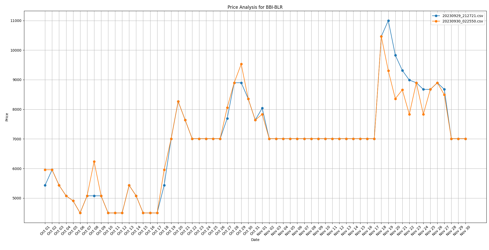

# Flight Price Analyzer

Flight Price Analyzer is a Python tool that helps track and visualize flight prices over time. With the ability to group prices based on specific routes, the tool provides insights into price trends, helping users make informed decisions.

## Features:

- **Data Storage**: Flight prices are stored in CSV format, grouped by flight routes.
- **Data Analysis**: Allows users to analyze historical prices for a specific flight route.
- **Visualizations**: Uses Matplotlib to plot price trends over time.

## Prerequisites:

- Python 3.x
- Matplotlib

## Getting Started:

### Installation:

1. **Clone the repository**:
   ```
   git clone https://github.com/saketharshraj/mmt-price-extractor-and-analysis.git
   ```
2. **Navigate to the project directory**:
   ```
   cd mmt-price-extractor-and-analysis
   ```
3. **Install the required Python packages**:
   ```
   pip install -r requirements.txt
   ```

### Usage:

1. **Data Extraction**:

- Ensure you have a structured HTML containing the flight data.
- Run the extraction script:
  ```
  python extract_data.py
  ```

This will prompt you to select an existing group (flight route) or create a new one, and then it will save the extracted data in the corresponding directory.

2. **Data Analysis**:

- Once you have the data, run the analysis script:
  ```
  python analyze_data.py
  ```

This will show a list of available groups. Select the desired group to view the price trend visualization.

## Graph Interpretation:

When you run the analysis, you'll be presented with a graph that plots dates against prices. Each line represents the price trend as captured on a specific day. This way, you can compare how the flight prices for future dates changed from one day to another.

For instance, you can see how the prices for all days in October looked on September 29th, September 30th, and so on. This helps in understanding the dynamics of flight pricing for specific routes. 



## Contributions:

Contributions are welcome! If you find any bugs or wish to suggest improvements, please open an issue or send a pull request.

## License:

This project is licensed under the MIT License - see the [LICENSE](LICENSE) file for details.
